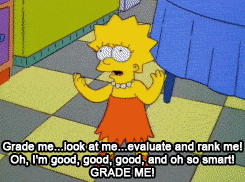
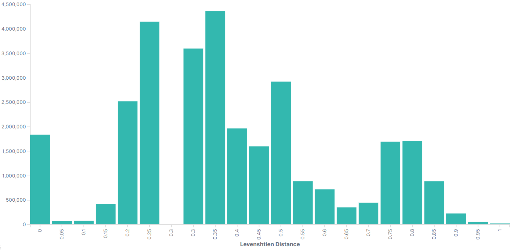
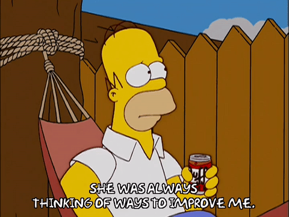
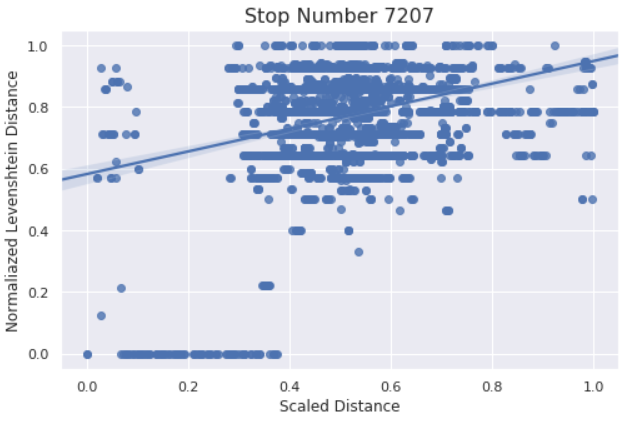
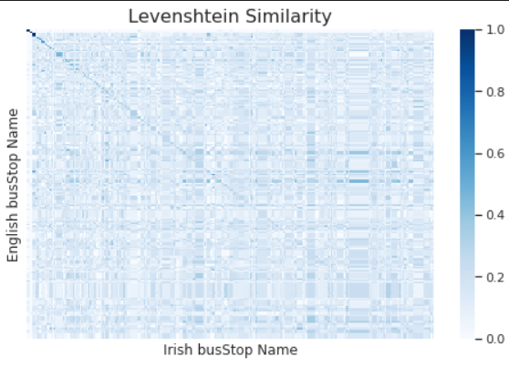

include::_settings_reveal.adoc[]
:icons: font

= Data Gathering & Management
:title-slide-transition: zoom

Final Task

== The Data

`230 million` records from bus sensors within Dublin, between July 2017 to September 2018.

== Extract, Transform, Load.

[.step]
* _Apache Spark_(TM) as processing framework.
* We've filtered records that doesn't correspond with a specified route (line @ station).
* An additional feature was added, `direction`, which specifies the direction of movement (slope).
* All the data was loaded onto _Elasticsearch_ pass:[&#x1f499;] cluster.

[.notes]
--
* Data integration explained later
* direction was added for UKMeans
--

== Uncertain data

Our task is to shed some light over the data uncertainty. +
`busStop` & `atStop` are both prime suspects. 

image::../images/stop-415-heatmap.png[,70%]

[.notes]
--
* Bus Stop 415 Heatmap
* we suspect busStop & atStop was calculated and not reported
--

== Uncertain, Real-Time

[.step]
* We intend to estimate the *true* location of a bus stop, from the observed data. +
* While reading a stream, we will _fix_ `busStop` to the closest station (which is _on-route_). +
* After each batch, we will update our estimations with the _new_ data.
* To avoid extra noise - we will set `atStop` to all reports within `50 meters` from it's _fixed_ station.

[.notes]
--
* Resembles EM
* atStop fixing will not affect estimation updates, to allow bias
* Estimation update is done via "online weighted average"
--

== Estimations

For all estimations, we've used only reports with `atStop = True`.

[.step]
* Simple centroid
* K-Means
* UK-Means (line-moving)
* UK-Means (free-moving)

[.notes]
--
* Centroid is calculated per `busStop`.
--

=== K-Means adaptation

The data is very dense. +
-> bus reports near stations that aren't on their route.

Instead of *restricting* K-Means algorithm, we will partition the data by `JourneyPatternId`. +
This will allow convergence only to stations along the route.

[.notes]
--
* KMeans will label lines that are close to centroids which isn't on their route.
--

=== UK-Means

Following our presented article: +
(`Uncertain Data Mining: An Example in Clustering Location Data`) +
We've implemented Uncertain data clustering algorithm, which targets moving object uncertainty.

image::../images/ukmeans.png[]

[.notes]
--
* Moving - Directed (line) & Free (radius)
--

=== UK-Means adaptation

[.step]
* *Line-moving uncertainty:* +
We've used the calculated `direction` at each `atStop` report as the line's slope. +
The length was determined as `50 meters`.

* *Free-moving uncertainty:* +
The radius was defined to `50 meters`. +
underlying assumption is uniform distribution around the centroid.

== 

== YOU CAN'T HANDLE THE TRUTH!

== These are not the droids you are looking for...

== But, how can we REALLY know?

To evaluate our predictions, we've accessed RTPI API service to collect the *true* location of each bus stop in our data.

== Textual Data Integration

* We've used "`HERE Maps`" REST-API to __reverse geocode__ (coordinates -> street address) all `atStop` observations from the data (`50 million`).

* Then we've added (from RTPi) all the bus stations names, both in English & Gaeilge (Irish).

We plan to calculate the __distance__ between the reported bus station name, and the actual street address derived from the coordinates.

[.notes]
--
* The mentioned API has a strong limitation of 50 requests per second, if we were to retrieve all street addresses, it would've take two weeks.

* We were able to reduce the amount of required requests from the API to `300,000`, by reducing the coordinates precision to 5 decimal degrees (`~1 squared meter` error).

* This is under an assumption that most bus stations names are determined by the street they are located in.

--

== Text Distance

We used Levenshtien distance (normalized) to calculate the distance between names (street, bus station). 

Levenshtein distance between two words is the minimum number of single-character edits (insertions, deletions or substitutions) required to change one word into the other.

== Levenshtien On Data

== Improve the prediction

=== These are not the droids you are looking for

We will use Levenshtien distance to filter all observations which are not __close__ enough to its reported bus station. 

====
We defined __close__ with Levenshtien distance < `0.5`.
====

=== Results

.MSE Comparsion (Km^2^)
[width="70%",options="header"]
|====================
|Task 3  | Task 4

|0.10125
|__0.2739__

|====================

== Textual Analysis

image::../images/word.gif[,80%]

=== Name vs. Location

Following our prediction task, we were interested in the relation between the textual & spatial distance.

[.notes]
--
We computed the Levenshtien distance & hoversine distance from a between all bus stops (to all bus stops). +
To visualize it, we will present a scatter plot for bus stop `7207`
--

=== Gaeilge vs. English names

Following our article presentation (GNMT), we were interested wether bus stations names have some similarity between English & Gaeilge (Irish).

[.notes]
--
We were able to compute a confusion matrix to represent the Levenshtien similarity (normalized distance) between Gaeilge & English station names:
--

== Questions?

image::..\images\que.gif[,70%]