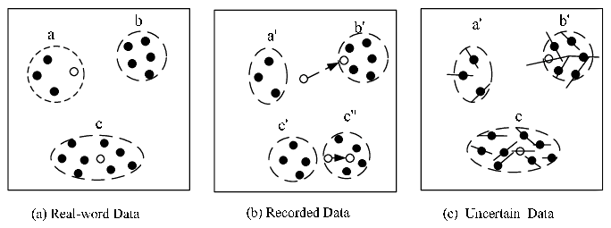

include::_settings_reveal.adoc[]
:icons: font

= Data Gathering & Management
:title-slide-transition: zoom

Final Task

== The Data

`230 million` records from bus sensors within Dublin,
between July 2017 to September 2018.

== Extract, Transform, Load.

[.step]
* _Apache Spark_(TM) as processing framework.
* We've filtered records that doesn't correspond with a specified route (line @ station).
* An additional feature was added, `direction`, which specifies the direction of movement (slope).
* All the data was loaded onto _Elasticsearch_ pass:[&#x1f499;] cluster.

[.notes]
--
* Data integration explained later
* direction was added for UKMeans
--

== Uncertain data

Our task is to shed some light over the data uncertainty. +
`busStop` & `atStop` are both prime suspects. 

image::../images/stop-415-heatmap.png[,70%]

[.notes]
--
* Bus Stop 415 Heatmap
* we suspect busStop & atStop was calculated and not reported
--

== Uncertain, Real-Time

[.step]
* We intend to estimate the *true* location of a bus stop, from the observed data. +
* While reading a stream, we will _fix_ `busStop` to the closest station (which is _on-route_). +
* After each batch, we will update our estimations with the _new_ data.
* To avoid extra noise - we will set `atStop` to all reports within `50 meters` from it's _fixed_ station.

[.notes]
--
* Resembles EM
* atStop fixing will not affect estimation updates, to allow bias
* Estimation update is done via "online weighted average"
--

== Uncertain?

image::..\images\word.gif[,80%]

[.notes]
--
* Data uncertainty is an inherent property due to measurement inaccuracy, sampling discrepancy, or other errors
* Data values are no longer discrete. uncertain data has to be summarized into atomic values. +
Unfortunately, discrepancy in the summarized recorded values and the actual values could seriously affect the results
--

== Estimations

For all estimations, we've used only reports +
with `atStop = True`.

[.step]
* Filtered centroids
* K-Means
* UK-Means (line-moving)
* UK-Means (free-moving)

[.notes]
--
* Centroid is calculated per `busStop`.
* Filtered centroids: Centroids -> filter by 100m -> centroids
--

=== K-Means adaptation

The data is very dense. +
-> bus reports near stations that aren't on their route.

Instead of *restricting* K-Means algorithm, +
we will partition the data by `JourneyPatternId`. +
This will allow convergence only to stations along the route.

[.notes]
--
* KMeans will label lines that are close to centroids which isn't on their route.
--

=== UK-Means

Following our presented article: +
(`Uncertain Data Mining: An Example in Clustering Location Data`) +
We've implemented Uncertain data clustering algorithm, which targets moving object uncertainty.

[.notes]
--
* Moving - Directed (line) & Free (radius)
--

=== UK-Means adaptation

[.step]
* *Line-moving uncertainty:* +
We've used the calculated `direction` at each `atStop` report as the line's slope. +
The length was determined as `50 meters`.

* *Free-moving uncertainty:* +
The radius was defined to `50 meters`. +
underlying assumption is uniform distribution around the centroid.

== Data Integration

[.step]
* We've accessed `Dublinked Open Data` to collect all route information (stations along route). 
* To evaluate our predictions, we've collected the *true* location of each bus station.

[.notes]
--
* Was used to filter data
* For query optimization, we've created a static dump in ES.
--

[%notitle, background-iframe="http://da2019w-1019.eastus.cloudapp.azure.com:5601/app/kibana#/dashboard/58c241d0-3b5b-11ea-ab79-e1fb616a8ad9?embed=true&_g=(refreshInterval%3A(pause%3A!t%2Cvalue%3A0)%2Ctime%3A(from%3A'2017-07-02T21%3A00%3A00.000Z'%2Cto%3A'2017-07-03T20%3A30%3A00.000Z'))"]
== Kibana

== Results

[width="70%",options="header"]
|====================
|Improvement  | RMSE (`meters`)

|Filter centroids
|158.6048

|K-Means 
|458.3147

|UK-Means (line)
|458.3147

|UK-Means (free)
|458.3147
|====================

== Future work

[.step]
* Web-app, to load batch data, that will estimate and visualize correct info (`busStop`, `atStop`).
* Integrate K-Means & UK-Means to handle stream data
* Allow different estimators to predict `busStop` & `atStop`.
* Display distance to next stop, and possible ETA.

[.notes]
--
With better estimations of atStop & busStop, we can now analyze the data much better, to predict congestions etc.
--

[%notitle]
== Questions?

image::..\images\que.gif[background,size=contain]