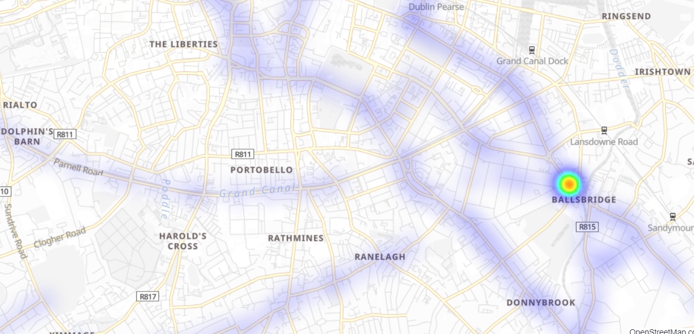
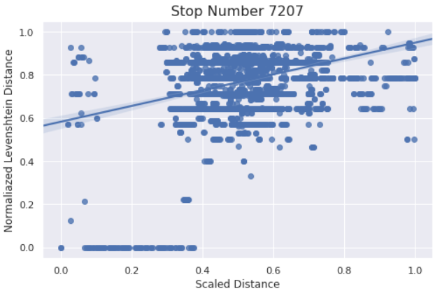
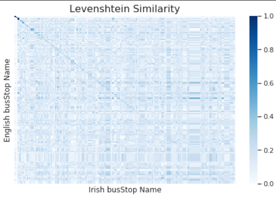

include::_settings_reveal.adoc[]
// include::_settings_deck.adoc[]

= Data Gathering & Management

Textual Data Task

== Data Warehouse setup

During our ETL process, we've loaded onto an Elasticsearch cluster all the records that reported `atStop`.

____
This was done in order to drastically reduce the data load (25% remained), while having a minimal effect on possible insights.
____

== Where is the bus stop?

We intend to predict the *true* coordinates of a bus stop.

.Bus Stop 415 Heatmap

== Few possible reasons...

[%step]
* GPS report is not accurate
+
Uncalibrated GPS sensor, due to signal blockage or a system delay, which results in reporting `atStop` while not actually at the stop.

* Reported Bus Stop is incorrect
+
Reported `busStop` is incorrect, due to some possible system malfunction.

== But, how can we REALLY know?

To evaluate our predictions, we've accessed RTPI API service to collect the *true* location of each bus stop in our data.

== Textual Data Integration

* We've used "`HERE Maps`" REST-API to __reverse geocode__ (coordinates -> street address) all `atStop` observations from the data (`50 million`).

* Then we've added (from RTPi) all the bus stations names, both in English & Gaeilge (Irish).

We plan to calculate the __distance__ between the reported bus station name, and the actual street address derived from the coordinates.

[.notes]
--
* The mentioned API has a strong limitation of 50 requests per second, if we were to retrieve all street addresses, it would've take two weeks.

* We were able to reduce the amount of required requests from the API to `300,000`, by reducing the coordinates precision to 5 decimal degrees (`~1 squared meter` error).

* This is under an assumption that most bus stations names are determined by the street they are located in.

--

== Text Distance

We used Levenshtien distance (normalized) to calculate the distance between names (street, bus station). 

Levenshtein distance between two words is the minimum number of single-character edits (insertions, deletions or substitutions) required to change one word into the other.

== Improve the prediction

=== These are not the droids you are looking for

We will use Levenshtien distance to filter all observations which are not __close__ enough to its reported bus station. +
We defined __close__ any Levenshtien distance that is lower than `0.2`.

=== Results

.MSE Comparsion (Km^2^)
[width="70%",options="header"]
|====================
|Task 3  | Task 4

|0.10125
|__BETTER__

|====================

== Textual Analysis

image::../images/word.gif[,80%]

=== Name vs. Location

Following our prediction task, we were interested in the relation between the textual & spatial distance.

[.notes]
--
We computed the Levenshtien distance & hoversine distance from a between all bus stops (to all bus stops). +
To visualize it, we will present a scatter plot for bus stop `7207`
--

=== Gaeilge vs. English names

Following our article presentation (GNMT), we were interested wether bus stations names have some similarity between English & Gaeilge (Irish).

[.notes]
--
We were able to compute a confusion matrix to represent the Levenshtien similarity (normalized distance) between Gaeilge & English station names:
--

== Questions?

image::..\images\que.gif[,90%]