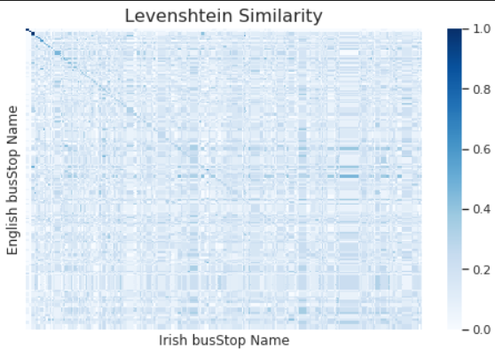

= Data Management & Gathering - NLP
Shahar Rotem; Afik Bar
:doctype: article
:encoding: utf-8
:lang: en
:numbered!:
:stem:

== Prediction Task

We intend to predict the *true* coordinates of a bus stop.

From our data exploration, we've discovered some uncertainty in the data, in the following image, we've created a heatmap for all the reported stops at bus stop `415`.

.Bus Stop 415 Heatmap
image::.\images\stop-415-heatmap.png[pdfwidth=70vw]

From previous labs, we suspect that many reports report the **wrong** bus stop number.

== Textual Data Integration

We've used "`HERE Maps`" REST-API to __reverse geocode__ (translating coordinates to street address) all `atStop` observations from the data (`50 million`).

The mentioned API has a strong limitation of 50 requests per second, if we were to retrieve all street addresses, it would've take two weeks.

We were able to reduce the amount of required requests from the API to `300,000`, by reducing the coordinates precision to 5 decimal degrees (`1 squared meter` error).

Then we've added (from RTPi) all the bus stations names, both in English & Gaeilge (Irish).

We plan to calculate the __distance__ between the reported bus station name, and the actual street address derived from the coordinates.

This is under an assumption that most bus stations names are determined by the street they are located in.

== Text Distance

We decided to use Levenshtien distance (normalized) to calculate the distance between names (street, bus station). It measures both characters order, and content, while takes into consideration different word lengths.

Levenshtein distance between two words is the minimum number of single-character edits (insertions, deletions or substitutions) required to change one word into the other.

== Improve the prediction

We will use Levenshtien distance to filter all observations which are not __close__ enough to its reported bus station. 

We were able to improve our *best prediction* from Task 3.

After applying the same __removal__ approach, that obtained the best results previously, we were able to improve our prediction by 10%, while using the integrated data.

.MSE Comparsion of Removal method
[width="50%",options="header"]
|====================
|Task 2  | Task 3

|0.1189
|0.10125

|====================

== Textual Analysis

Following our prediction task, we were interested in the relation between the textual distance & spatial distance of bus stations. +
We computed the Levenshtien distance & hoversine distance from a between all bus stops (to all bus stops). +
To visualize it, we will present a scatter plot for bus stop `7207`:

image::images/analysis1.png[]

Following our article presentation (GNMT), we were interested wether bus stations names have some similarity between English & Gaeilge (Irish).

We were able to compute a confusion matrix to represent the Levenshtien similarity (normalized distance) between Gaeilge & English station names:

